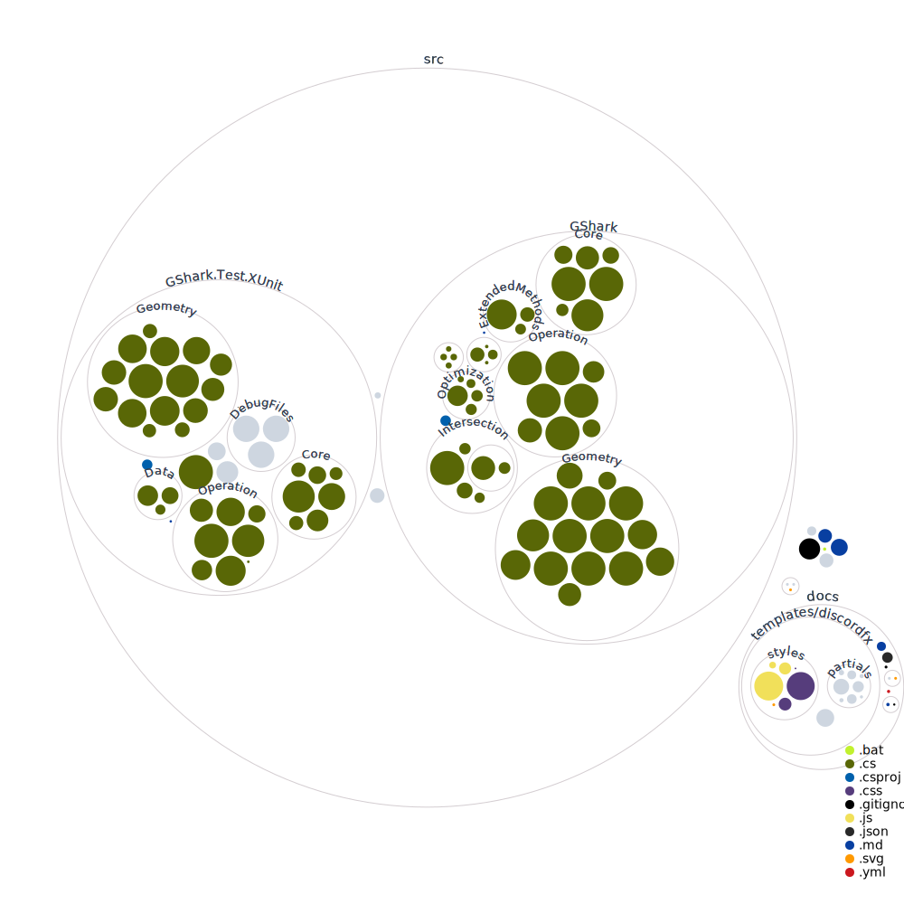

# The project
**G-Shark** is short for **Geometry Shark**. It all started with a need for a geometry library able to handle curves, surfaces, meshes and solids written in C#. Although there
are plenty of geometry libraries written in a variety of languages including C, C++, Python and some also in C# but, as is often the case, we could not find a library that encompassed all the functionality that we were looking for in one place.

For this reason we began work on this ambitious project to create an easy to use, well documented, and highly functional geometry library for C# development, targeted primarily at the AECO sector and computational designers. We've gone back to the text books and first principles of computational geometry, and we learn what we can from the great work done by others before us for which we are very thankful, in particular [Verb](http://verbnurbs.com/) which is our reference for the backbone of this library. 

We try to write and commit code every day and look forward to contributions from the open source dev community. 

There's a tonne of work to be done and we appreciate all the help we can get! If you would like to contribute, reach out and we'll have you committing code in no time! :) 

## Contributing to G-Shark
[Guidelines](CONTRIBUTING.md)

## Documentation
[G-Shark Doc](https://gsharker.github.io/G-Shark/)

## Our Codebase

This is an example of using the [repo-visualizer](https://github.com/githubocto/repo-visualizer) GitHub Action.

We've included the generated diagram by adding it to the README:

You can check out the whole GitHub Action at [diagram.yml](/.github/workflows/generate_diagram.yml). Notice that we're excluding the `ignore` and `.github` folders, using the `excluded_paths` config.
